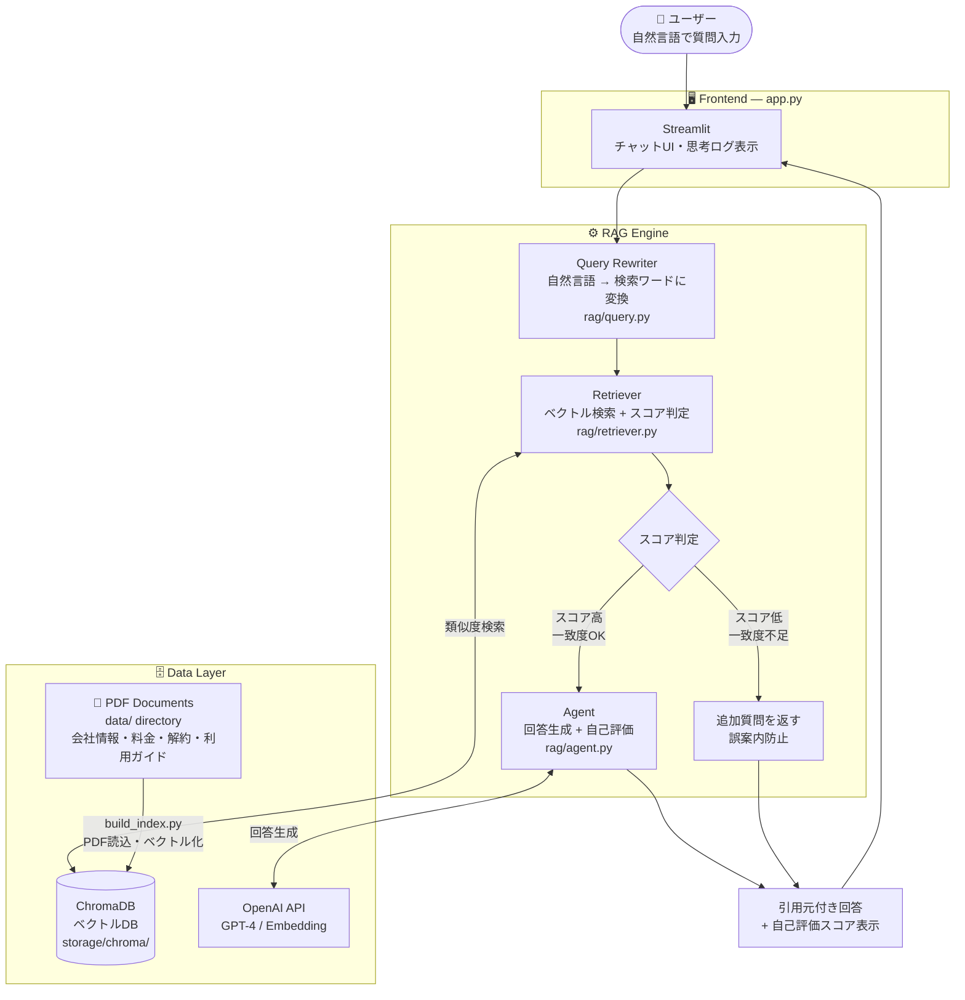

# RAG Customer Support Agent (Streamlit)

## はじめに

このリポジトリは、  
**実務で通用するRAG構成を設計・実装・説明まで一貫して示すポートフォリオ**です。

PDFや社内資料をそのまま活かし、  
検索（Retriever）と生成（LLM）を組み合わせた構成で、

**再現性のある実装**と  
**業務に寄せた回答設計**を重視しました。

---

## 📌 概要

本ツールは、  
**社内資料やPDFを知識源として、問い合わせ対応を自動化・効率化するAIエージェント**です。

解約・返金・請求などの定型問い合わせに対し、  
関連資料を検索した上で、  
**根拠を明示した補助回答**を提示します。

---

## 🎯 設計背景：現場経験から生まれた2つのモード構成

私は過去にコール業務・チャット業務の両方を担当していました。

同じ問い合わせ対応でも、

- コール業務では「即時性」「会話の流れを止めない補助」が重要
- チャット業務では「文章の正確性」「根拠の確認しやすさ」が重要

という明確な違いがあります。

そのため本エージェントは、
単にRAGで回答を生成するツールではなく、

## 📞 コールモード
通話業務を想定した即時応答支援モード  
音声入力・音声読み上げに対応し、会話を止めない補助設計

## 💬 チャットモード
テキスト業務に最適化されたRAG回答支援  
根拠確認・文章構成を重視した設計

という **業務特性に合わせた2つの利用モード** を実装しました。

「RAGを使う」だけではなく、  
**業務にどう適応させるか** を重視した設計です。

## 🚀 目的

**一次対応をAIに任せ、業務効率と回答品質を両立させること**が目的です。

LLM単体ではなく、  
検索＋生成（RAG）構成を採用し、  
**実務で安全に使えることを前提**に設計しています。

※ 最終判断は人が行う前提の「支援」用途を想定しています。

## 💡 解決できる課題

- **問い合わせのたびに資料確認で時間がかかる**
- **担当者ごとに回答内容がブレる**
- **FAQでは表現ゆれに対応しづらい**
- **チャネル（電話 / チャット）ごとに求められる対応品質が異なる**

本ツールで  
**対応時間短縮・回答品質の統一・担当者負荷の軽減** を狙います。

---

## 📂 ディレクトリ構成

```
.
├── app.py            # Streamlit アプリ本体
├── build_index.py    # PDF → ベクトルDB作成
├── config.py         # アプリ全体の設定値を一元管理
├── requirements.txt  # 依存ライブラリ一覧
├── .gitignore
├── data/
│   ├── company/      # 会社情報（架空）
│   ├── customer/     # カスタマープロフィール（架空）
│   └── service/      # 料金・解約・利用ガイド等（架空）
├── rag/
│   ├── loader.py     # PDFの読み込み処理
│   ├── retriever.py  # ベクトル検索処理
│   └── prompt.py     # プロンプト管理
├── storage/
│   └── chroma/       # ChromaDB 永続化データ
└── images/           # README用画像
```

※ `data/` 配下のPDFは **すべて架空データ** です。

---

## 🎬 デモ動画

https://github.com/user-attachments/assets/891a50f0-a908-47d6-b82d-7496fa31d8d2

---

## 🧠 システム構成

* **UI**：Streamlit
* **LLM**：OpenAI API（via LangChain）
* **Embedding / Vector DB**：ChromaDB
* **Document Loader**：PDF（pypdf）
* **検索方式**：Similarity Search + RAG

---

## 🏗️ システムアーキテクチャ



## 🔄 処理フロー

| ステップ | 処理内容 |
|---|---|
| ① | ユーザーが自然言語で質問を入力 |
| ② | Query Rewriterが検索ワードに変換・カテゴリ推定 |
| ③ | ChromaDBでベクトル類似度検索を実行 |
| ④ | スコアが低い場合は追加質問を返す（誤案内防止） |
| ⑤ | スコアが高い場合はAgentが回答を生成 |
| ⑥ | AIが回答の精度・完全性を自己評価してスコア表示 |
| ⑦ | 引用元ドキュメント・ページ番号付きで回答を返却 |

## 🎯 精度改善の工夫

- **クエリ書き換え** — 口語的な質問を検索に適した形に自動変換し検索精度を向上
- **スコア足切り** — 一致度が低い場合は回答せず追加質問を返すことで誤案内を防止
- **AI自己評価** — 回答の精度・完全性を0〜100でスコアリングして可視化
- **引用元の明示** — 参照したドキュメント名・ページ番号を回答に付与
```
---

## 🖥 使用環境

* OS：macOS（MacBook環境で開発・動作確認）／Windows・Linux も対応可（仮想環境・依存関係の調整が必要）
* Python：3.11
* フレームワーク：Streamlit
* LLM：OpenAI API（LangChain経由）
* ベクトルDB：ChromaDB
* 主なライブラリ：LangChain, ChromaDB, PyPDF, Streamlit
* デプロイ：Streamlit Cloud

---

## 🧩 拡張予定機能

* 回答の根拠PDFを画面上に明示（引用表示）
* カテゴリ別検索の精度向上
* 管理者向けログ・評価画面の追加
* 多言語対応（日本語 / 英語）
* 認証・利用制限機能の追加
* 音声通話対応（音声入力 / 音声読み上げ / 通話UI）

---

## セットアップ手順

### 1. リポジトリをクローン

```bash
git clone https://github.com/biguver-cloud/rag-customer-support-agent.git
cd rag-customer-support-agent
```

### 2. 仮想環境の作成（任意）

```bash
python -m venv venv
source venv/bin/activate  # Mac/Linux
# venv\\Scripts\\activate   # Windows
```

### 3. 依存関係をインストール

```bash
pip install -r requirements.txt
```

### 4. 環境変数の設定

`.env` ファイルを作成し、OpenAI APIキーを設定してください。

```env
OPENAI_API_KEY=your_api_key_here
```

---

## 📄 PDFインデックスの作成

PDFを差し替えた場合や、初回起動時は以下を実行します。

```bash
python build_index.py
```

成功すると `storage/chroma` にベクトルDBが作成されます。

---

## 🖥 アプリ起動

```bash
streamlit run app.py
```

ブラウザで以下にアクセスします。

```
http://localhost:8501
```

---

## 💬 動作イメージ

* ユーザーが問い合わせを入力
* 関連するPDF内容を検索
* 根拠に基づいた回答を生成
* 判断が必要な内容は「案内」に留める

---

## ⚠️ 注意事項

本プロジェクトは **学習・ポートフォリオ目的** です。

実在の企業・人物・サービスは含まれていません。

**実運用時に追加で必要な対応**

* 認証・認可
* ログ管理
* 個人情報マスキング
* プロンプト・回答制御の強化

---

## 🛠 今後の改善案

* 回答根拠PDFの明示（引用表示）
* カテゴリ別検索制御
* 管理者向けログ・評価UI
* マルチ言語対応
* デプロイ（Streamlit Cloud / Render / Cloud Run 等）

---

## 👤 Author

GitHub: https://github.com/biguver-cloud

---

## 📄 License

This project is for educational and demonstration purposes only.

---

## おわりに

本プロジェクトは、  
**「実際の業務でどう使われるか」**  
**「クライアントや利用者にとって何が価値になるか」**  
を軸に設計しました。

RAGや生成AI、業務自動化は、  
まだ**正解の形が定まっていない領域**です。  
だからこそ、小さく作り、実際に動かしながら  
**改善を重ねていくプロセス**に価値があると考えています。

このREADMEやデモを通じて、  
「自分たちの業務にも応用できそう」と  
感じていただけたのであれば幸いです。

最後までご覧いただき、ありがとうございました。

