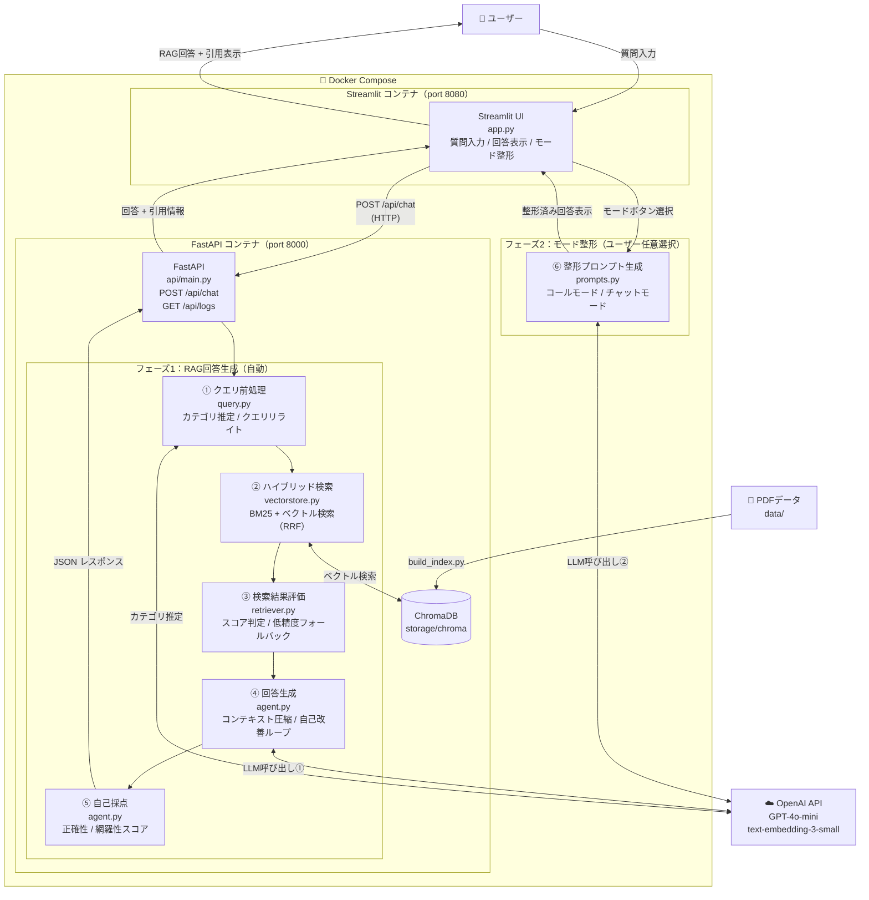

# RAG Customer Support Agent

## 🎯 概要

このリポジトリは、**実務で通用するRAG構成を設計・実装・説明まで一貫して示すポートフォリオ**です。

社内資料やPDFを知識源として、問い合わせ対応を自動化・効率化するAIエージェントです。  
解約・返金・請求などの定型問い合わせに対し、関連資料を検索した上で、**根拠を明示した補助回答**を提示します。

---

## 🌐 デモ

**👉 [https://rag-support-agent-498951365205.asia-northeast1.run.app](https://rag-support-agent-498951365205.asia-northeast1.run.app)**

> Google Cloud Run にデプロイ済みです。ブラウザからそのまま動作を確認できます。  
> ※ 初回アクセス時はコンテナ起動のため、数秒〜十数秒かかる場合があります。  
> ※ 使用データはすべて架空のサンプルデータです。

**試しに入力できる質問例**
- `解約したい`
- `返金条件を教えて`
- `請求内容を確認したい`

---

## 🚀 使い方

▼質問 → 回答フロー

https://github.com/user-attachments/assets/09b27d8c-bafe-4760-8d4e-d2710fd66f32

▼モード別機能

https://github.com/user-attachments/assets/a8828b2f-cff0-4631-8615-f3369f0e04f4

---

## 🎓 目的

**一次対応をAIに任せ、業務効率と回答品質を両立させること**が目的です。

LLM単体ではなく、検索＋生成（RAG）構成を採用し、**実務で安全に使えることを前提**に設計しています。

**解決できる課題**

- 問い合わせのたびに資料確認で時間がかかる
- 担当者ごとに回答内容がブレる
- FAQでは表現ゆれに対応しづらい
- チャネル（電話 / チャット）ごとに求められる対応品質が異なる

※ 最終判断は人が行う前提の「支援」用途を想定しています。

---

## ✨ 工夫した点

「RAGを使う」だけではなく、**業務にどう適応させるか**を重視した設計です。

### 📞 コールモード
通話業務を想定したトークスクリプト生成モード。RAGによる検索・回答をもとに、そのまま使える大まかなトークスクリプトを自動生成し、円滑なオペレーションをサポートします。

### 💬 チャットモード
チャット業務に最適化された返信文生成モード。RAGによる回答をもとに、チャットツールにそのまま貼り付けられる返信文を生成。ワンクリックでコピーも可能です。

### 📊 ログCSVエクスポート機能
蓄積された問い合わせ対応のログをCSV形式でダウンロード・確認できる機能。質問・回答・自己評価スコア・引用元などの履歴を一覧で確認・分析でき、**対応品質の振り返りや改善に活用**できます。

---


## 📁 ディレクトリ構成

```
.
├── app.py                  # Streamlit フロントエンド（FastAPI クライアント）
├── build_index.py          # PDF → ベクトルDB作成
├── create_pdfs.py          # サンプルPDF生成スクリプト
├── requirements.txt        # 依存ライブラリ一覧
├── Dockerfile.api          # FastAPI コンテナ（uvicorn port 8000）
├── Dockerfile.streamlit    # Streamlit コンテナ（port 8080）
├── docker-compose.yml      # 2サービス構成（api + streamlit）
├── Dockerfile              # Cloud Run 用単一コンテナ
├── cloudbuild.yaml         # Cloud Build 設定（ビルド→デプロイ）
├── start.sh                # Cloud Run 用起動スクリプト
├── .dockerignore           # Docker ビルド除外ファイル
├── .env.example            # 環境変数のテンプレート
├── .gitignore
├── api/
│   ├── main.py             # FastAPI アプリ本体（CORS 設定）
│   ├── config.py           # CORS・セキュリティ設定
│   ├── schemas.py          # Pydantic リクエスト / レスポンス型定義
│   └── routers/
│       ├── chat.py         # POST /api/chat（RAG処理・ログ保存）
│       └── logs.py         # GET /api/logs, GET /api/logs/{filename}（API Key認証）
├── data/
│   ├── company/            # 会社情報（架空）
│   ├── customer/           # カスタマープロフィール（架空）
│   ├── service/            # 料金・解約・利用ガイド等（架空）
│   ├── technical/          # トラブルシューティング・不具合対処法（架空）
│   ├── legal/              # 利用規約・プライバシーポリシー（架空）
│   ├── security/           # セキュリティポリシー・アクセス制御（架空）
│   └── release/            # リリースノート・新機能ガイド（架空）
├── eval/
│   ├── run_eval.py         # 精度評価スクリプト（ベクトル vs ハイブリッド）
│   ├── generate_dataset.py # 評価用データセット生成
│   ├── metrics.py          # 評価指標（LLM judge・文字類似度）
│   ├── dataset.json        # 評価用データセット（202問）
│   └── results/            # 評価結果CSV
├── rag/
│   ├── agent.py            # LLM回答生成・自己改善ループ
│   ├── config.py           # RAGモジュール設定値
│   ├── loader.py           # PDF読み込み処理
│   ├── prompts.py          # プロンプトテンプレート管理
│   ├── query.py            # クエリ前処理・カテゴリ推定
│   ├── retriever.py        # 検索結果評価・スコア判定・フォールバック処理
│   ├── ui.py               # Streamlit UIヘルパー
│   └── vectorstore.py      # ハイブリッド検索（BM25 + Janome + ベクトル）
├── storage/
│   └── chroma/             # ChromaDB 永続化データ
└── images/                 # README用画像
```

※ `data/` 配下のPDFは **すべて架空データ** です。

---

## 🛠️ 技術スタック

| 役割 | 技術 |
|---|---|
| フロントエンド | Streamlit |
| バックエンド API | FastAPI + uvicorn |
| LLM | OpenAI API（via LangChain） |
| Embedding | OpenAI text-embedding-3-small |
| Vector DB | ChromaDB |
| 検索方式 | BM25 + ベクトル検索（ハイブリッド） |
| コンテナ | Docker / Docker Compose |
| デプロイ | Google Cloud Run |

---

## 🏗️ アーキテクチャ図




### 🔄 処理フロー

**フェーズ1：RAG回答生成（自動）**

| ステップ | 項目 |
|:---:|:---|
| ① | **クエリ前処理**: LLMによるカテゴリ推定と、検索精度を高めるためのクエリ最適化（リライト） |
| ② | **ハイブリッド検索**: BM25（単語一致）とベクトル（意味一致）を組み合わせた高度な検索を実行 |
| ③ | **検索結果の評価**: 検索スコアに基づき、情報不足や低精度の場合は「追加質問」や「記載なし」を返却 |
| ④ | **エージェント回答生成**: 参照資料の圧縮と、エージェントによる自己レビュー（修正ループ）を経て回答を生成 |
| ⑤ | **自己採点**: AIが生成した回答の「正確性」と「網羅性」を客観的に評価しスコア化 |

**フェーズ2：モード整形（ユーザー任意選択）**

| ステップ | 項目 |
|:---:|:---|
| ⑥ | **モード選択**: ユーザーが「📞 コールモード」または「💬 チャットモード」ボタンを選択 |
| ⑦ | **整形出力**: 選択モードに応じたプロンプトでLLMを再呼び出しし、用途に最適化された文章を生成 |

### 🌐 API エンドポイント一覧

| メソッド | パス | 説明 |
|:---:|:---|:---|
| `GET` | `/health` | ヘルスチェック |
| `POST` | `/api/chat` | 質問を受け取りRAG回答を返す |
| `GET` | `/api/logs` | ログファイル一覧を返す |
| `GET` | `/api/logs/{filename}` | 指定ログファイルをCSVダウンロード |

> FastAPI の自動生成ドキュメントは `http://localhost:8000/docs` で確認できます。

---

## ⚙️ セットアップ手順

### 1. リポジトリをクローン

```bash
git clone https://github.com/biguver-cloud/rag-customer-support-agent.git
cd rag-customer-support-agent
```

### 2. 環境変数の設定

`.env.example` をコピーして `.env` を作成し、OpenAI APIキーを設定します。

```bash
cp .env.example .env
```

`.env` を編集：

```env
OPENAI_API_KEY=your_api_key_here
```

### 3. アプリの起動

**Docker（推奨）**

`api` コンテナがビルド時に自動で `build_index.py` を実行するため、別途インデックス作成は不要です。

```bash
docker compose up --build
```

| サービス | URL |
|:---|:---|
| Streamlit UI | `http://localhost:8080` |
| FastAPI ドキュメント | `http://localhost:8000/docs` |

**ローカル（Docker なし）**

```bash
pip install -r requirements.txt

# 1. ベクトルDBを作成
python build_index.py

# 2. FastAPI バックエンドを起動（ターミナル1）
uvicorn api.main:app --reload

# 3. Streamlit フロントエンドを起動（ターミナル2）
streamlit run app.py
```

| サービス | URL |
|:---|:---|
| Streamlit UI | `http://localhost:8501` |
| FastAPI ドキュメント | `http://localhost:8000/docs` |

> ローカル実行時は Streamlit が `API_URL=http://localhost:8000` をデフォルトで使用します。  
> 別ホストに変更する場合は `.env` に `API_URL=http://<host>:<port>` を追記してください。

---

## 🔮 今後の拡張予定

- 多言語対応（日本語 / 英語）
- 音声通話対応（音声入力 / 音声読み上げ / 通話UI）

---

## 👤 Author

GitHub: https://github.com/biguver-cloud

---

## 📄 License

This project is for educational and demonstration purposes only.  
本プロジェクトは学習・ポートフォリオ目的です。実在の企業・人物・サービスは含まれていません。
