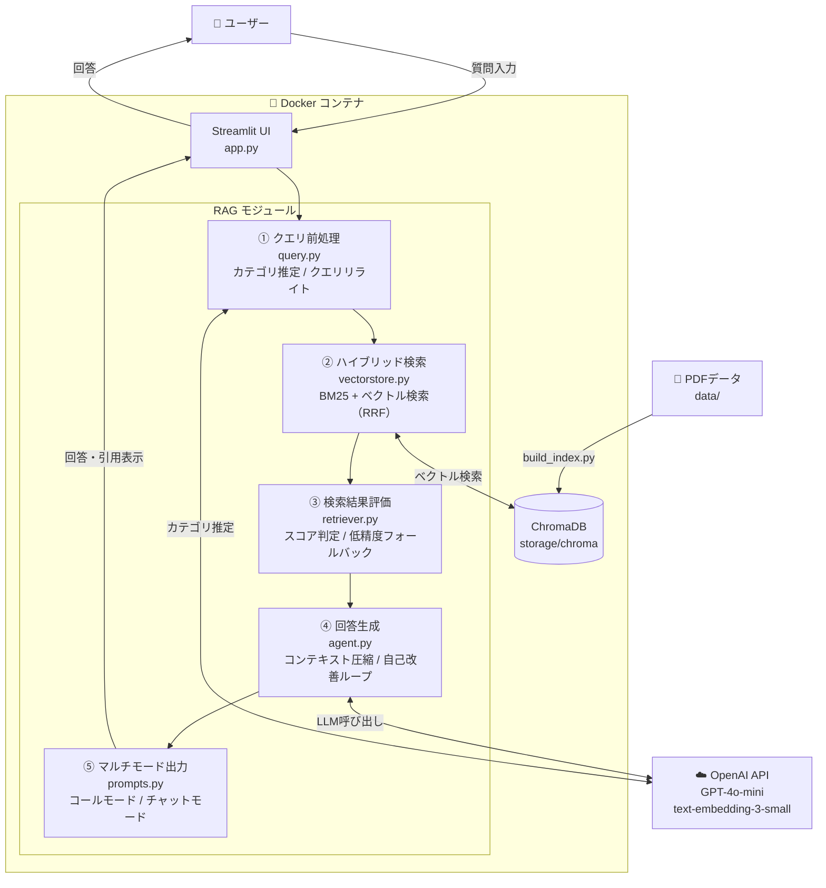

# RAG Customer Support Agent (Streamlit)

## 🎯 概要

このリポジトリは、**実務で通用するRAG構成を設計・実装・説明まで一貫して示すポートフォリオ**です。

社内資料やPDFを知識源として、問い合わせ対応を自動化・効率化するAIエージェントです。  
解約・返金・請求などの定型問い合わせに対し、関連資料を検索した上で、**根拠を明示した補助回答**を提示します。

---

## 🎓 目的

**一次対応をAIに任せ、業務効率と回答品質を両立させること**が目的です。

LLM単体ではなく、検索＋生成（RAG）構成を採用し、**実務で安全に使えることを前提**に設計しています。

**解決できる課題**

- 問い合わせのたびに資料確認で時間がかかる
- 担当者ごとに回答内容がブレる
- FAQでは表現ゆれに対応しづらい
- チャネル（電話 / チャット）ごとに求められる対応品質が異なる

※ 最終判断は人が行う前提の「支援」用途を想定しています。

---

## ✨ 工夫した点

「RAGを使う」だけではなく、**業務にどう適応させるか**を重視した設計です。

### 📞 コールモード
通話業務を想定したトークスクリプト生成モード。RAGによる検索・回答をもとに、そのまま使える大まかなトークスクリプトを自動生成し、円滑なオペレーションをサポートします。

### 💬 チャットモード
チャット業務に最適化された返信文生成モード。RAGによる回答をもとに、チャットツールにそのまま貼り付けられる返信文を生成。ワンクリックでコピーも可能です。

### 📊 ログCSVエクスポート機能
蓄積された問い合わせ対応のログをCSV形式でダウンロード・確認できる機能。質問・回答・自己評価スコア・引用元などの履歴を一覧で確認・分析でき、**対応品質の振り返りや改善に活用**できます。

---

## 📁 ディレクトリ構成

```
.
├── app.py              # Streamlit アプリ本体
├── build_index.py      # PDF → ベクトルDB作成
├── config.py           # アプリ全体の設定値を一元管理
├── requirements.txt    # 依存ライブラリ一覧
├── Dockerfile          # Docker イメージビルド定義
├── docker-compose.yml  # コンテナ起動設定
├── .dockerignore       # Docker ビルド除外ファイル
├── .env.example        # 環境変数のテンプレート
├── .gitignore
├── data/
│   ├── company/        # 会社情報（架空）
│   ├── customer/       # カスタマープロフィール（架空）
│   └── service/        # 料金・解約・利用ガイド等（架空）
├── rag/
│   ├── agent.py        # LLM回答生成・自己改善ループ
│   ├── config.py       # RAGモジュール設定値
│   ├── loader.py       # PDF読み込み処理
│   ├── prompts.py      # プロンプトテンプレート管理
│   ├── query.py        # クエリ前処理・カテゴリ推定
│   ├── retriever.py    # ベクトル検索処理
│   ├── ui.py           # Streamlit UIヘルパー
│   └── vectorstore.py  # ハイブリッド検索（BM25 + ベクトル）
├── storage/
│   └── chroma/         # ChromaDB 永続化データ
└── images/             # README用画像
```

※ `data/` 配下のPDFは **すべて架空データ** です。

---

## 🛠️ 技術スタック

| 役割 | 技術 |
|---|---|
| UI | Streamlit |
| LLM | OpenAI API（via LangChain） |
| Embedding / Vector DB | ChromaDB |
| Document Loader | PDF（pypdf） |
| 検索方式 | BM25 + ベクトル検索（ハイブリッド） |
| コンテナ | Docker / Docker Compose |

---

## 🏗️ アーキテクチャ図



### 🔄 処理フロー

| ステップ | 項目 |
|:---:|:---|
| ① | **ユーザー入力**: ユーザーが自然言語で質問を入力 |
| ② | **クエリ前処理**: LLMによるカテゴリ推定と、検索精度を高めるためのクエリ最適化（リライト） |
| ③ | **ハイブリッド検索**: BM25（単語一致）とベクトル（意味一致）を組み合わせた高度な検索を実行 |
| ④ | **検索結果の評価**: 検索スコアに基づき、情報不足や低精度の場合は「追加質問」や「記載なし」を返却 |
| ⑤ | **エージェント回答生成**: 参照資料の圧縮と、エージェントによる自己レビュー（修正ループ）を経て回答を生成 |
| ⑥ | **自己採点**: AIが生成した回答の「正確性」と「網羅性」を客観的に評価しスコア化 |
| ⑦ | **マルチモード出力**: 引用元付きの回答表示、および用途に応じた形式（話し言葉等）への変換 |

---

## ⚙️ セットアップ手順

### 1. リポジトリをクローン

```bash
git clone https://github.com/biguver-cloud/rag-customer-support-agent.git
cd rag-customer-support-agent
```

### 2. 環境変数の設定

`.env.example` をコピーして `.env` を作成し、OpenAI APIキーを設定します。

```bash
cp .env.example .env
```

`.env` を編集：

```env
OPENAI_API_KEY=your_api_key_here
```

### 3. インデックスの作成

```bash
python build_index.py
```

### 4. アプリの起動

**Docker（推奨）**

```bash
docker compose up --build
```

**ローカル**

```bash
pip install -r requirements.txt
streamlit run app.py
```

ブラウザで `http://localhost:8501` にアクセスして利用できます。

---

## 🚀 使い方

▼質問 → 回答フロー

https://github.com/user-attachments/assets/09b27d8c-bafe-4760-8d4e-d2710fd66f32

▼モード別機能

https://github.com/user-attachments/assets/a8828b2f-cff0-4631-8615-f3369f0e04f4

---

## 🖥️ 使用環境

- OS：Windows 11（Windows環境で開発・動作確認）／macOS・Linux も対応可
- Python：3.11
- フレームワーク：Streamlit
- LLM：OpenAI API（LangChain経由）
- ベクトルDB：ChromaDB
- 主なライブラリ：LangChain, ChromaDB, PyPDF, Streamlit
- コンテナ：Docker / Docker Compose

---

## 🔮 今後の拡張予定

- 多言語対応（日本語 / 英語）
- 認証・利用制限機能の追加
- 音声通話対応（音声入力 / 音声読み上げ / 通話UI）
- デプロイ（Cloud Run 等）

---

## 👤 Author

GitHub: https://github.com/biguver-cloud

---

## 📄 License

This project is for educational and demonstration purposes only.  
本プロジェクトは学習・ポートフォリオ目的です。実在の企業・人物・サービスは含まれていません。
