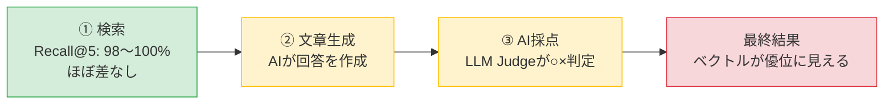

# RAG 精度評価レポート

> 本レポートは2026-09時点で全面的に作り直したものです。旧版は測定方法（データセット・LLM Judge）に信頼性の問題があったため、`eval/REPORT_archive.md` に退避し、本文からは参照しません。

## 📌 TL;DR（3行で分かる結論）

すでに採用している**ハイブリッド検索（BM25＋ベクトル検索）**が、単純な**ベクトル検索**より本当に優れているかを、4種類の角度から検証した。

- 最終的な回答の正しさだけを見ると、**当初の想定に反してベクトル検索が上回るケースが多かった**
- しかし「検索が正解の資料を見つけられているか」だけを切り出して測ると（LLMを使わない客観指標）、**両手法ともほぼ100%で差がなく、むしろハイブリッドの方が正解をより上位に出せていた**
- つまり差の原因は検索そのものではなく、**その後の文章生成・AI採点の段階**にあると判明した

**結論：ハイブリッド検索の設計は技術的に間違っていない。ただし、今回の検証規模（71チャンク）では、その優位性を最終結果に活かしきれておらず、複雑さに見合うリターンが出ていない。**

### 差はどこで生まれていたか

**①検索の時点ではほぼ互角（むしろハイブリッドが優位）なのに、②③を経ると④ではベクトルが優位に見える** — この「途中で何が起きているか」を切り分けたことが、今回の検証の一番の成果。

### 結果一覧

| 検証 | 結果 | 一言で |
|:---|:---:|:---|
| 形態素解析（Janome） | ベクトル優位（-2.4〜-4.8%） | Janomeは差を緩和するが埋めきれない |
| クエリリライト | ベクトル優位（-5.7%）／リライト時は不安定 | 結論は保留 |
| 口語データセット | ほぼ互角、僅差でハイブリッド | 崩れた入力ではベクトルの優位性が消える |
| **検索単体（Recall@5・LLM不使用）** | **ほぼ同点（98〜100%）、順位はハイブリッド優位** | **検索自体には差がない** |

 

---

<b>📋 検証の背景・アプローチ（クリックで展開）</b>

### 検証目的

すでに採用しているハイブリッド検索（BM25 + ベクトル検索 / RRF統合）の設計判断の妥当性を、比較検証を通じて定量的に確認する。

過去の検証（`REPORT_archive.md`）で、以下2点の測定方法自体の信頼性問題が判明したため、これらを解消した上でゼロから検証をやり直した。

- LLM Judgeの判定が不安定だった（同一の生成回答でも判定が割れる、判定理由が回答本文と矛盾する等）
- ゴールドアンサーに「窓口へ確認を」という非回答型・曖昧型の内容が混在していた

### 今回の変更点（前回との違い）

| 項目 | 前回 | 今回 |
|:---|:---|:---|
| データセット | 202問（非回答型ゴールドアンサーが14件以上混入） | **112問**に再生成。非回答型は実質0件 |
| 参照元PDF | 問い合わせ対応方針.pdf を含む | 同PDFを削除、ファイル名も整理 |
| LLM Judge | 1回判定・○/×のみ | **3回判定＋多数決**、判定基準を明文化し言い換えを許容 |
| ベースライン | フェーズ間で使い回し | **使い回さず、フェーズごとに毎回新規3回実行** |

### 評価手法

| 手法 | 説明 |
|:---|:---|
| **ベクトル検索** | OpenAI `text-embedding-3-small` による意味的類似度検索 |
| **ハイブリッド検索** | BM25（キーワード）＋ ベクトル検索を RRF で統合 |
| **LLM as a Judge** | `gpt-4o-mini` が期待回答と生成回答を比較し ○/× を判定。3回判定し多数決 |

 

<b>📊 第1フェーズ：形態素解析（Janome）検証（クリックで展開）</b>

**実施日**: 2026-09-24　**データセット**: 112問　**条件**: Janomeあり/なし × 各3回

> Janomeはハイブリッド検索（BM25）のみに影響するため、ベクトル検索側の結果は1回だけ新規計算して使い回している（コスト最適化）。

| 条件 | ベクトル平均 | ハイブリッド平均 | 差分 |
|:---|:---:|:---:|:---:|
| Janomeあり | 79.2%（stdev 1.0%） | 76.8%（stdev 1.6%） | **-2.4%** |
| Janomeなし | 79.2%（stdev 1.0%） | 74.4%（stdev 3.4%） | **-4.8%** |

**結論**
- 6回すべてでベクトル検索がハイブリッド検索を上回った
- Janomeはハイブリッドの弱点を緩和する（差-4.8%→-2.4%）が、埋めきれない
- Janomeはハイブリッドの安定性も改善する（stdev 3.4%→1.6%）
- LLM Judgeの一致率は約95%が3/3満場一致で、旧Judgeの不安定さは大きく改善

 

<b>📊 第2フェーズ：クエリリライト検証（クリックで展開）</b>

**実施日**: 2026-09-25　**データセット**: 112問　**条件**: リライトあり/なし × 各3回

| 条件 | ベクトル平均 | ハイブリッド平均 | 差分 |
|:---|:---:|:---:|:---:|
| リライトなし | 78.9%（stdev 1.4%） | 73.2%（stdev 1.8%） | **-5.7%** |
| リライトあり | 78.9%（stdev 3.4%） | 81.2%（stdev 4.7%） | **+2.4%** |

**結論**
- 平均だけ見るとリライトありでハイブリッドが逆転するが、内訳は+8.0%・+4.5%・-5.4%とばらつきが大きく、断定はできない
- リライトを入れると両手法とも正解率のばらつきが2〜3倍に拡大する（特にハイブリッド側）
- リライトなし条件では、Janome検証と同じ「ベクトルが一貫して優位」という傾向が再現された

 

<b>📊 第3フェーズ：口語データセット検証（クリックで展開）</b>

**実施日**: 2026-09-26　**データセット**: 口語化した112問　**条件**: リライトあり/なし × 各3回

| 条件 | ベクトル平均 | ハイブリッド平均 | 差分 |
|:---|:---:|:---:|:---:|
| リライトなし | 75.6%（stdev 3.6%） | 76.8%（stdev 2.4%） | **+1.2%** |
| リライトあり | 78.6%（stdev 2.4%） | 79.2%（stdev 3.7%） | **+0.6%** |

**結論**
- 標準データセットで一貫していた「ベクトル優位」の傾向が、口語データセットでは再現されなかった
- ただし差分はごく僅かで、stdevの範囲内に収まる差でしかなく断定はできない
- 「入力が口語・崩れた表現になるほど、ベクトル検索の優位性が薄れる」という仮説は支持されるが、確証には至らない

 

<b>🎯 補助検証：検索単体の精度評価（Recall@5 / MRR）（クリックで折りたたみ）</b>

**実施日**: 2026-09-30　**評価スクリプト**: `eval/run_retrieval_eval.py`（LLMを使わない検索単体評価）

### なぜやったか

第1〜第3フェーズはLLM Judgeによる最終回答の○/×判定であり、「検索が悪いのか」「生成が悪いのか」「Judgeが誤判定したのか」を切り分けられないという限界があった。そこで各質問に「正解チャンク」を自動ラベリングし（112問中12問をスポットチェックし全問正解を確認）、**検索結果だけをLLM抜きで機械的に評価**した。

### 結果

| 条件 | ベクトルRecall@5 | ハイブリッドRecall@5 | ベクトルMRR | ハイブリッドMRR |
|:---|:---:|:---:|:---:|:---:|
| 標準（Janomeあり・リライトなし） | 100.0% | 100.0% | 0.823 | **0.903** |
| 標準（Janomeなし） | 100.0% | 93.8% | 0.823 | 0.697 |
| 標準（リライトあり） | 100.0% | 100.0% | 0.810 | **0.938** |
| 口語（Janomeあり・リライトなし） | 100.0% | 98.2% | 0.798 | **0.844** |

*Recall@5：正解チャンクが検索結果の上位5件に入っていた割合／MRR：正解チャンクが平均して何位に出てきたか（1に近いほど上位）*

### 結論

- **Recall@5はほぼ全条件で98〜100%。検索そのものはほぼ確実に正解を見つけられていた。** 第1〜第3フェーズの「ベクトルが優位」という差は、検索精度の差ではなく**生成またはLLM Judgeの段階で生じていた可能性が非常に高い**
- **MRR（正解の順位）はJanomeなし条件を除きハイブリッドが一貫して優位。** 検索の質だけを見ればハイブリッドの方が優れている
- **Janomeの効果は検索レベルでも裏付けられた。** JanomeなしにするとハイブリッドのRecall@5が93.8%まで低下し、MRRも大きく悪化する

### 限界

Recall@5は検索単体の指標であり、生成・Judgeの問題そのものを解決するものではない。正解チャンクの自動ラベリングも完全な保証ではない（ただしスポットチェックでは全問正解）。

 

---

## 🧭 総合判断：ハイブリッド検索の設計は妥当だったか

| 問い | 判定 | 根拠 |
|:---|:---:|:---|
| ハイブリッドの設計は間違っていたか | **いいえ** | Recall@5・MRRで見る限り、仕組み自体は正しく機能し、正解の順位付けはベクトルより一貫して良い |
| ベクトル検索だけで足りたか | **はい（この規模では）** | Recall@5が全条件でベクトル単体100%。71チャンクという規模なら、ベクトルだけで正解に確実にたどり着けている |
| 設計として過剰（オーバースペック）だったか | **概ねその通り** | 検索の精度で稼いだ優位性が、最終的な回答の正しさに結びついていない |

**総括**：ハイブリッド検索という設計判断そのものは妥当で、将来データ量が増えれば真価を発揮する可能性が高い。ただし、今回のポートフォリオ規模のデータでは、その優位性を活かしきれておらず、複雑さに見合うリターンが出ていない、というのが最も正確な評価。

---

## 評価環境

| 項目 | 内容 |
|:---|:---|
| 埋め込みモデル | `text-embedding-3-small`（OpenAI）|
| 生成モデル | `gpt-4o-mini` |
| ベクトルDB | ChromaDB |
| BM25 ライブラリ | `rank-bm25 0.2.2` |
| 形態素解析 | Janome |
| 評価スクリプト | `eval/run_eval.py` / `eval/run_retrieval_eval.py` |
| LLM Judge | `llm_judge_majority()`（3票多数決、判定基準明文化） |
| インデックス構築 | `build_index.py`（PDF 16件・ページ 66件・チャンク 71件、2026-08-07再構築） |
| データセット | `eval/dataset.json`（112問、2026-08-24再生成） |

## 参考：旧レポート

初期検証（202問・旧Judge）の詳細は `eval/REPORT_archive.md` を参照。数値は測定方法の信頼性問題があるため、結論の根拠としては採用しない。
